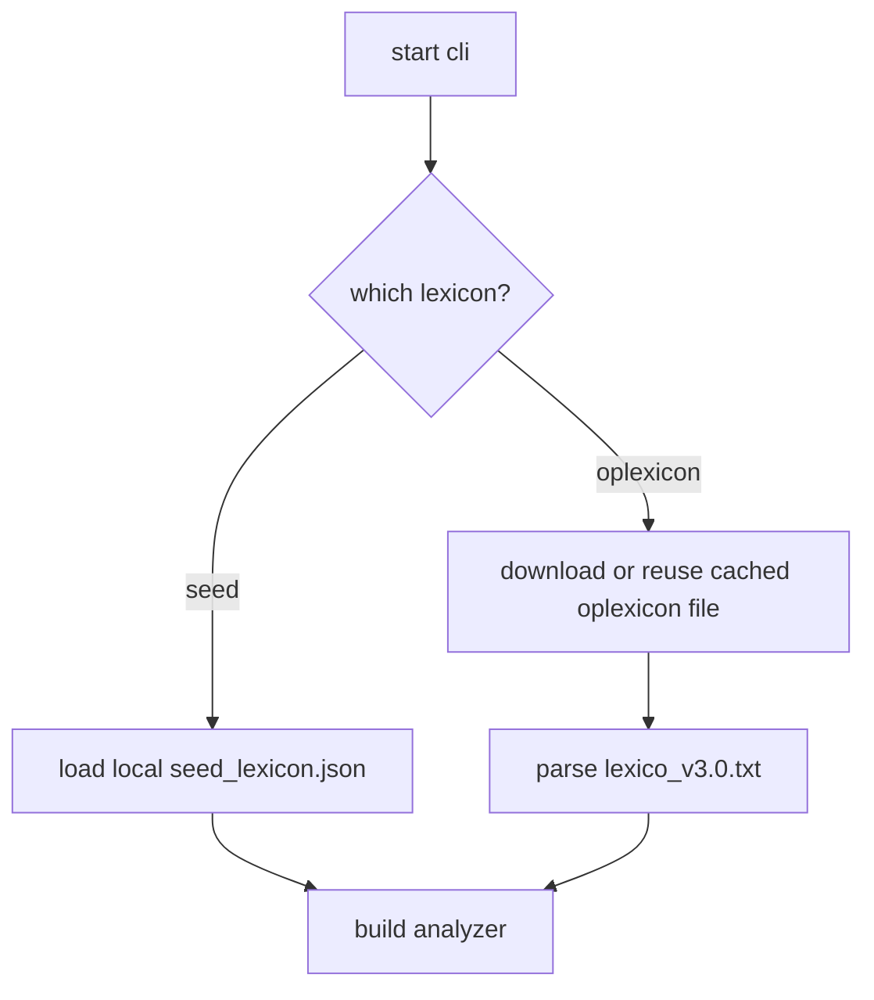
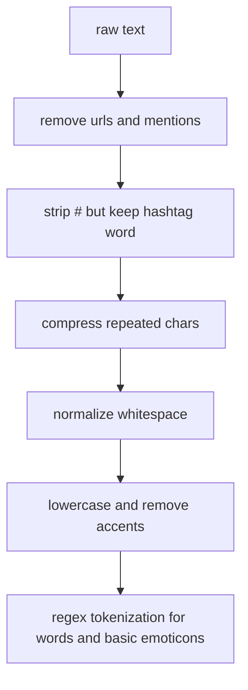
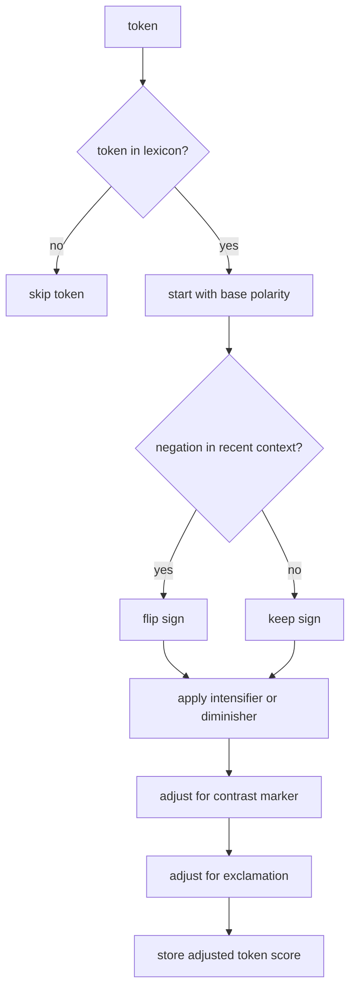
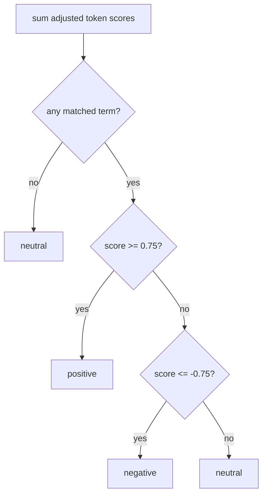

# methodology

this file explains how the current baseline works, what was created by us, and what comes from an external lexical resource.

## 1. lexicon source

the project currently supports two lexical sources.

### 1.1 built-in seed dictionary

the built-in dictionary was created manually by us for the baseline. it was not mined from a corpus and it was not copied from a public sentiment lexicon.

the idea was simple:

- pick a small set of common brazilian portuguese words that clearly carry positive or negative sentiment
- assign a manual score by perceived intensity
- keep the scale small and interpretable, with weak words closer to zero and strong words farther from zero

examples:

- `bom`, `boa`, `legal` get small positive values
- `amei`, `otimo`, `maravilhoso` get stronger positive values
- `ruim`, `confuso`, `chato` get negative values
- `odiei`, `horrivel`, `pessimo` get stronger negative values

this is best described as a hand-built seed lexicon for a minimal symbolic prototype.

### 1.2 oplexicon v3.0

the second option uses `oplexicon v3.0`, which is an external portuguese sentiment lexicon published by the pucrs group.

in the code, we load the file `lexico_v3.0.txt` format, whose rows follow this structure:

- `term`
- `type`
- `polarity`
- `polarity_revision`

for example, the project reads rows like:

- `bom,adj,1,A`
- `ruim,adj,-1,A`
- `:),emot,1,A`

the implementation downloads and caches the raw file locally the first time `oplexicon` is selected.

### 1.3 source selection flow

## 2. preprocessing and tokenization

before scoring, the text goes through lightweight normalization.

### 2.1 preprocessing

the current pipeline does this:

- remove urls
- remove mentions like `@user`
- keep hashtag words but drop the `#`
- reduce repeated characters of length 3 or more to length 2
- normalize extra whitespace

this means a noisy input such as:

`ameiiii esse filme!!! #perfeito`

becomes something closer to:

`ameii esse filme!!! perfeito`

### 2.2 tokenization

after normalization, the text is folded to lowercase and accents are removed for matching.

examples:

- `ótimo` becomes `otimo`
- `péssimo` becomes `pessimo`

then the tokenizer extracts:

- alphanumeric word tokens
- basic emoticon tokens such as `:)`, `:(`, `=d`

this is done with regex based tokenization, not with a statistical tokenizer.

### 2.3 preprocessing flow

## 3. lexical scoring

once we have tokens, we score only the tokens that appear in the chosen lexicon.

### 3.1 direct lookup

each token is searched in the selected lexicon:

- if found, start from its base score
- if not found, skip it

### 3.2 rule adjustments

after the base score is found, a few symbolic rules can change it.

the current rules are:

- negation: if a negation appears in the previous three tokens, flip the polarity
- intensifier: if the previous token is something like `muito` or `super`, increase the magnitude
- diminisher: if the previous token is something like `pouco` or `quase`, reduce the magnitude
- contrast: if a marker like `mas` appears, give more weight to the clause after it
- exclamation: `!` slightly increases emotional strength

### 3.3 scoring flow

## 4. final label

the final sentence score is the sum of all adjusted token scores.

then we assign a label:

- `positive` if score >= `0.75`
- `negative` if score <= `-0.75`
- `neutral` otherwise

if no lexical match is found at all, the result is also `neutral`.

### 4.1 decision flow

## 5. how to explain it in the report

if you need to explain the current baseline honestly, the cleanest wording is:

1. the project implements a symbolic sentiment analyzer for short portuguese texts
2. the baseline uses a manually created seed dictionary designed for prototyping and debugging
3. the system also supports an external lexical resource, `oplexicon v3.0`, for a broader symbolic lexicon
4. tokenization is rule based and regex based after lightweight text normalization
5. the final prediction comes from lexical polarity plus symbolic rules for negation, intensification, contrast, and punctuation

## 6. important limitation

the built-in seed dictionary is intentionally small. it is useful for a minimal working prototype, but it is not enough to claim broad lexical coverage.

for a stronger experiment or evaluation, `oplexicon` should be the preferred lexical source.
