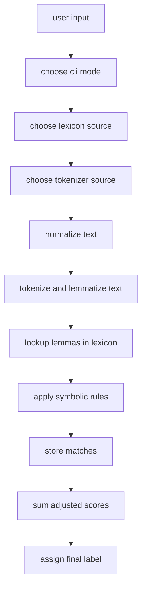
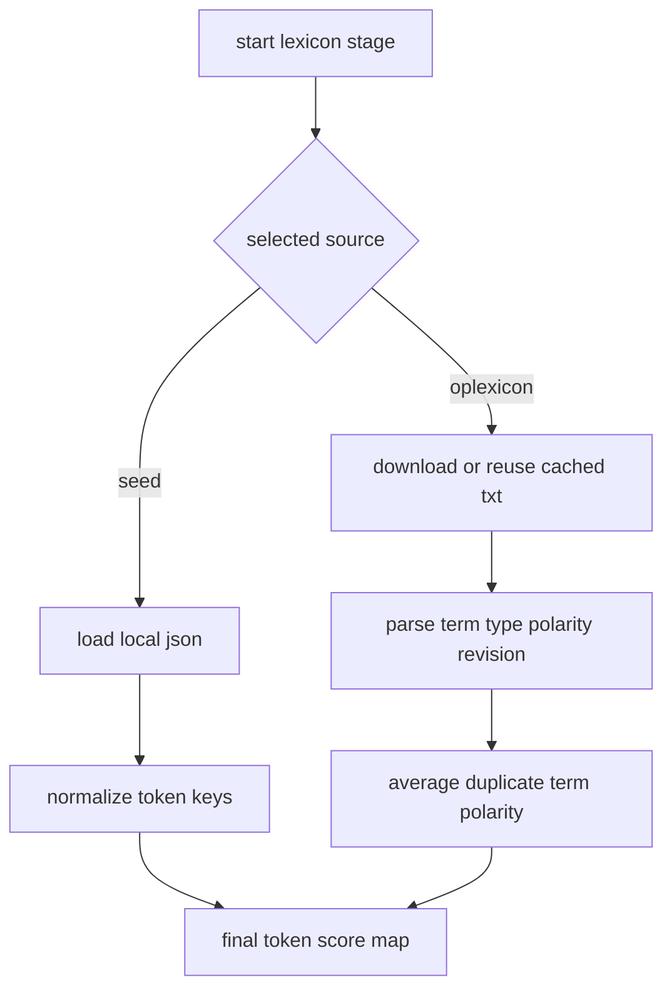
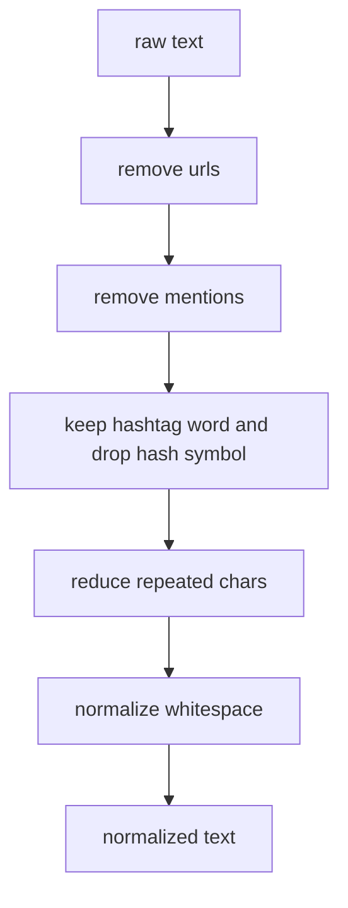
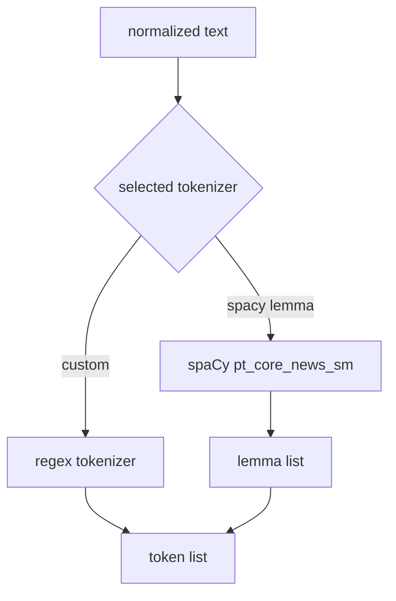
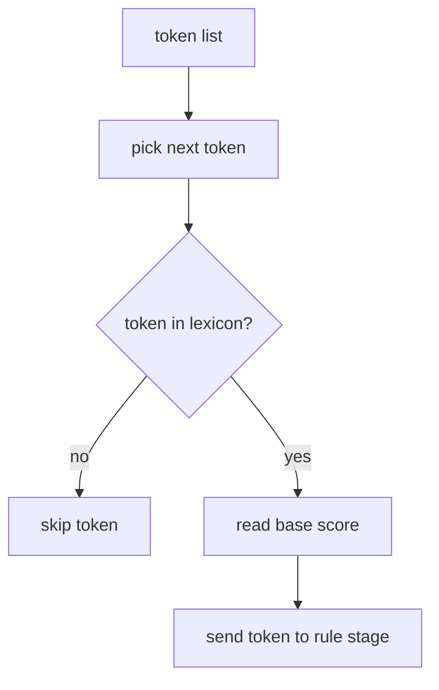
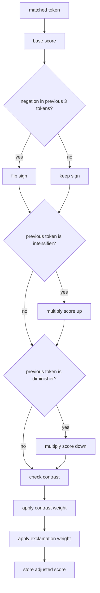
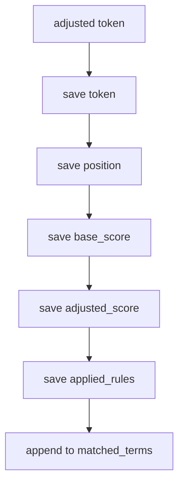
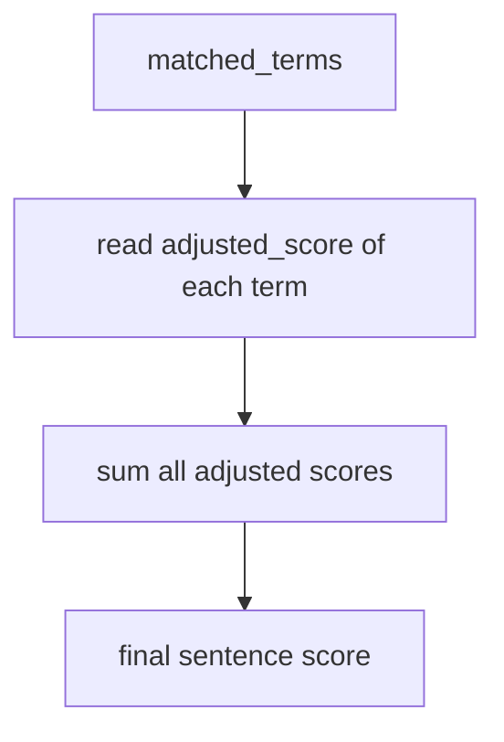
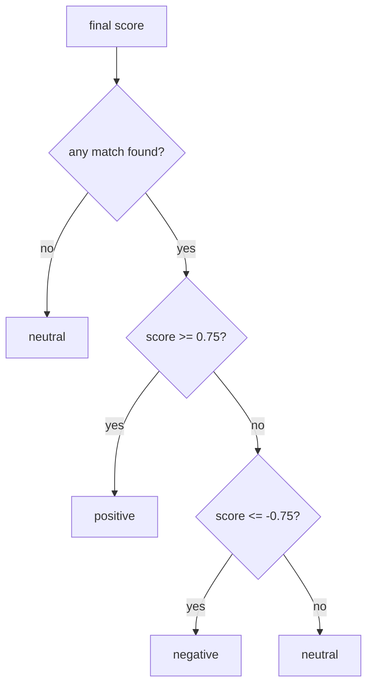

# pipeline processes

this file explains each stage of the symbolic pipeline in a more direct way.

for the split version with one file per process and one file per symbolic rule, see `docs/processes/00_index.md`.

## 1. full pipeline

the application follows a symbolic pipeline. it does not train a classifier. instead, it applies a sequence of deterministic steps.

## 2. lexicon process

the lexicon stage decides where token scores come from.

the project currently supports two lexicon sources.

1. `seed_lexicon.json`

this is our local hand built lexicon. it is a small prototype dictionary with manually assigned scores.

2. `oplexicon v3.0`

this is an external portuguese sentiment lexicon. the project downloads and caches it locally, then reads the official `lexico_v3.0.txt` format.

### how `oplexicon` differs from our local lexicon

the difference is not only where the file lives. it is also methodological.

1. our local lexicon is a seed dictionary written by us for a minimal symbolic prototype
2. `oplexicon` is a published external lexical resource
3. our local lexicon is small and intentionally selective
4. `oplexicon` has much broader coverage across words and emotive entries
5. our local scores were assigned manually by design choice
6. `oplexicon` polarity values come from the external resource and are parsed from its official file format

### how the lexicon stage works

### what happens internally

1. for the seed lexicon, the system loads the json file and normalizes the keys with lowercase and accent removal.
2. for oplexicon, the system reads each line as `term,type,polarity,polarity_revision`.
3. duplicate entries are grouped by token and averaged into one final polarity value per token.

## 3. normalization process

before tokenization, the text is cleaned.

### what each step does

1. urls are removed so they do not interfere with lexical lookup.
2. mentions such as `@ana` are removed for the same reason.
3. hashtags keep the word itself. `#cinema` becomes `cinema`.
4. repeated character sequences of length three or more are reduced to length two.
5. whitespace is normalized so tokenization is more stable.

## 4. tokenizer process

after normalization, the application tokenizes the text. the main application stack also lemmatizes the tokens. there are two tokenizer options.

1. custom tokenizer
2. spaCy portuguese lemmatizer

### tokenizer selection

### custom tokenizer

the custom tokenizer is the symbolic default.

it first folds the text:

1. lowercase with `casefold()`
2. remove accents with unicode normalization

then it extracts:

1. alphanumeric tokens
2. basic emoticons like `:)`, `:(`, `=d`

### spaCy portuguese lemmatizer

the second option uses spaCy with the `pt_core_news_sm` portuguese model.

this is a trained portuguese pipeline that includes tokenization, morphological analysis and lemmatization.

it still uses the project normalization first, then runs spaCy on the cleaned text and folds the resulting lemmas.

after that, the result is filtered so the final lemma list keeps only items compatible with the project token pattern. common auxiliary and copular lemmas such as `ser` and `estar` are removed because they can create false lexicon matches after lemmatization.

### how spaCy differs from the custom tokenizer

1. the custom tokenizer is fully handcrafted and regex based
2. spaCy is an external NLP library with a trained portuguese model
3. the custom tokenizer is simpler and more transparent for a symbolic baseline
4. spaCy gives stronger lexical coverage through lemmas without changing the scoring rules

## 5. lexicon lookup process

once the text is tokenized and lemmatized, each final token is checked against the selected lexicon.

### lookup behavior

1. if a token is not in the lexicon, it contributes nothing.
2. if a token is in the lexicon, it gets a base polarity score.
3. that base score is then modified by symbolic rules.

## 6. symbolic rule process

this is the heart of the symbolic system. each matched token starts from a base score, then a set of local rules may modify it.

### rule 1. negation

the system looks at the previous three tokens.

if any of them is in:

1. `nao`
2. `nem`
3. `nunca`
4. `jamais`
5. `sem`

then the sign of the current score is inverted.

example:

1. `gostei` might start positive
2. `nao gostei` flips that score to negative

### rule 2. intensifier

if the immediately previous token is an intensifier, the absolute value of the score increases.

current intensifiers are:

1. `muito`
2. `super`
3. `bem`
4. `demais`
5. `realmente`
6. `bastante`

example:

1. `bom` gets a positive score
2. `muito bom` multiplies that score by a stronger factor

### rule 3. diminisher

if the immediately previous token is a diminisher, the absolute value of the score decreases.

current diminishers are:

1. `pouco`
2. `meio`
3. `quase`

example:

1. `ruim` gets a negative score
2. `meio ruim` keeps the same sign but with lower magnitude

### rule 4. contrast

the pipeline looks for the last contrast marker in the sentence.

current contrast markers are:

1. `mas`
2. `porem`
3. `contudo`
4. `entretanto`

then it applies asymmetric weighting:

1. tokens before the contrast marker are multiplied by `0.7`
2. tokens after the contrast marker are multiplied by `1.3`

this makes the clause after `mas` more important than the clause before it.

example:

1. `o começo foi ruim, mas o final foi otimo`
2. the positive clause after `mas` gets more weight

### rule 5. exclamation

the pipeline counts exclamation marks in the original text, up to a maximum of three.

then it multiplies the score by:

`1 + 0.05 * exclamation_count`

so:

1. one exclamation increases intensity a little
2. three or more exclamations use the capped multiplier

this rule does not change the sign by itself. it only changes magnitude.

## 7. matches process

every token that survives lookup and rule adjustment becomes a stored match.

each match keeps:

1. `token`
2. `position`
3. `base_score`
4. `adjusted_score`
5. `applied_rules`

this is why the cli can show not only the final label, but also the reasoning trace token by token.

## 8. score aggregation process

after all matches are collected, the pipeline sums every adjusted score.

important detail:

1. the sum is rounded to three decimal places
2. if there are no matches, the score is effectively treated as neutral

## 9. label assignment process

the final label is assigned after score aggregation.

### thresholds

1. `positive` if score is greater than or equal to `0.75`
2. `negative` if score is less than or equal to `-0.75`
3. `neutral` otherwise

there is also an explicit safeguard:

1. if no lexical match exists, the label is `neutral`

## 10. how to describe the pipeline in one paragraph

if you need a short description for the report, this is the core idea:

the system receives a short text, normalizes it, tokenizes it, searches each token in the selected sentiment lexicon, applies symbolic rules for negation, intensity, contrast, and punctuation, stores the adjusted token matches, sums the adjusted scores, and converts the final score into a positive, negative, or neutral label.
