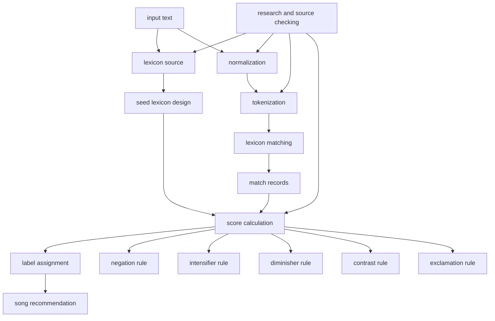

# process map

this folder breaks the symbolic pipeline into smaller files.

the idea is simple. instead of keeping all explanations in one long document, each process and each symbolic rule now has its own page.

## classification

1. core pipeline files
   1. `01_lexicon_sources.md`
   2. `03_normalization.md`
   3. `04_tokenization.md`
   4. `05_lexicon_matching.md`
   5. `06_match_records.md`
   6. `07_score_calculation.md`
   7. `08_label_assignment.md`

2. lexicon design files
   1. `02_seed_lexicon_design.md`

3. symbolic rule files
   1. `rules/01_negation.md`
   2. `rules/02_intensifiers.md`
   3. `rules/03_diminishers.md`
   4. `rules/04_contrast.md`
   5. `rules/05_exclamation.md`

4. research workflow file
   1. `09_research_and_sources.md`

5. recommendation file
   1. `10_song_recommendation.md`

## visual map

## how to use this folder

1. if you want the big picture, start with this file.
2. if you want to understand where a score comes from, read `07_score_calculation.md` and the files in `rules/`.
3. if you want to justify the lexical resource choice, read `01_lexicon_sources.md` and `02_seed_lexicon_design.md`.
4. if you need to update citations later, read `09_research_and_sources.md`.
5. if you want to understand how the app chooses songs after classification, read `10_song_recommendation.md`.

## references

1. Maite Taboada, Julian Brooke, Milan Tofiloski, Kimberly Voll, and Manfred Stede. *Lexicon Based Methods for Sentiment Analysis*. Computational Linguistics, 2011. [acl anthology](https://aclanthology.org/J11-2001/)
2. Marlo Souza, Renata Vieira, Debora Busetti, Rove Chishman, and Isa Mara Alves. *Construction of a Portuguese Opinion Lexicon from multiple resources*. STIL, 2011. [acl anthology](https://aclanthology.org/W11-4507/)
3. Marlo Souza and Renata Vieira. *Sentiment Analysis on Twitter Data for Portuguese Language*. PROPOR, 2012. [doi](https://doi.org/10.1007/978-3-642-28885-2_28)
