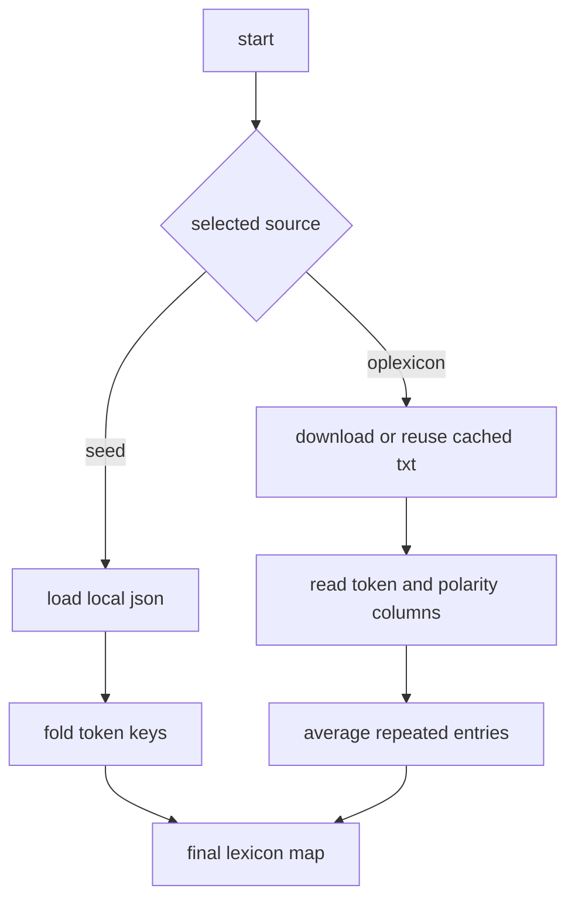

# lexicon sources

this file explains where token polarity comes from.

our code supports two lexicon sources.

1. a local seed lexicon stored in `src/pln_core/data/seed_lexicon.json`
2. `oplexicon v3.0`, downloaded and cached in `data/external/oplexicon_v3.0.txt`

## what the code does

1. if the selected source is `seed`, the project loads the bundled json file.
2. if the selected source is `oplexicon`, the project downloads the official text file once and reuses the cached copy after that.
3. all entries are folded to lowercase and accent free form before matching.
4. when `oplexicon` contains repeated surface forms, our loader averages the available polarity values for that token.

## visual flow

## why this design makes sense

the two sources serve different goals.

1. the seed lexicon is small, readable, and easy to defend in class because every entry can be inspected by hand.
2. `oplexicon` gives much wider coverage and ties the baseline to a published Portuguese sentiment resource.

this is a common tradeoff in lexicon based sentiment analysis. small hand built resources are easy to interpret, while larger published lexicons usually improve coverage.

## project note

the source selection itself is our project choice. the existence and description of `oplexicon` come from the published resource and its official page. the averaging of repeated `oplexicon` entries is our implementation detail so that the final dictionary has one score per folded token.

## example

if the input contains `otimo`, the two lexicons may behave differently.

1. in the seed lexicon, `otimo` maps directly to `2.3`
2. in `oplexicon`, the same form is read from the official file and interpreted according to its polarity annotation

## references

1. Marlo Souza, Renata Vieira, Debora Busetti, Rove Chishman, and Isa Mara Alves. *Construction of a Portuguese Opinion Lexicon from multiple resources*. STIL, 2011. [acl anthology](https://aclanthology.org/W11-4507/)
2. Marlo Souza and Renata Vieira. *Sentiment Analysis on Twitter Data for Portuguese Language*. PROPOR, 2012. [doi](https://doi.org/10.1007/978-3-642-28885-2_28)
3. PUCRS. *OpLexicon*. official resource page used to verify version and download links. [official page](https://www.inf.pucrs.br/linatural/wordpress/recursos-e-ferramentas/oplexicon/)
4. Maite Taboada, Julian Brooke, Milan Tofiloski, Kimberly Voll, and Manfred Stede. *Lexicon Based Methods for Sentiment Analysis*. Computational Linguistics, 2011. [acl anthology](https://aclanthology.org/J11-2001/)
