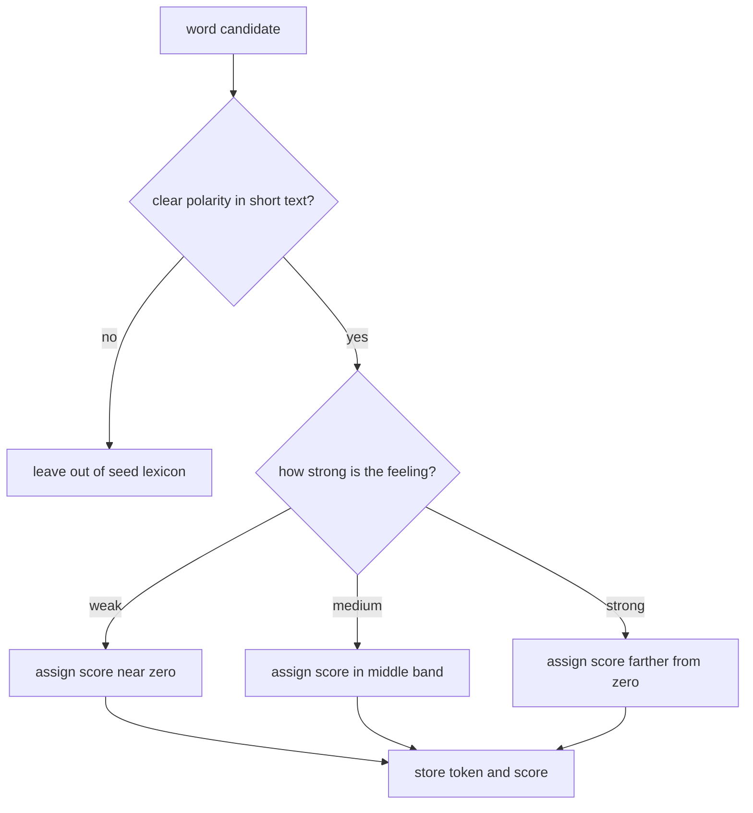

# seed lexicon design

this file explains how our local seed lexicon was created, why the words were chosen, and why the scores follow the current ranges.

## what we built

the file `seed_lexicon.json` is a manually written starter lexicon.

1. total entries: `51`
2. positive entries: `28`
3. negative entries: `23`
4. positive range: `0.8` to `2.6`
5. negative range: `-0.9` to `-2.6`

## why these words

we selected words that fit four practical conditions.

1. they are common in short brazilian portuguese opinions
2. their polarity is easy to justify without much context
3. they are useful for a first classroom demo
4. they appear in forms that are easy to match after normalization

this is why the lexicon includes words like `bom`, `otimo`, `amei`, `ruim`, `pessimo`, `horrivel`, and `odiei`, but does not try to cover every synonym, inflection, slang variant, or domain specific phrase.

## why these scores

our exact numbers are a project decision, but the idea behind them follows the literature on graded polarity.

1. lexicon based systems often work better when polarity is not reduced to only `1` and `-1`
2. many sentiment resources distinguish polarity and intensity, not only direction
3. this makes it possible to separate weak praise from strong praise, and mild criticism from harsh criticism

in our seed lexicon, the score bands are intentionally simple.

1. mild positive: around `0.8` to `1.2`
   examples: `rapido`, `tranquilo`, `bom`, `legal`
2. medium positive: around `1.3` to `1.8`
   examples: `animado`, `massa`, `recomendo`, `satisfeito`
3. strong positive: around `1.9` to `2.6`
   examples: `otimo`, `maravilhoso`, `amei`
4. mild negative: around `-0.9` to `-1.2`
   examples: `lento`, `caro`, `feio`
5. medium negative: around `-1.3` to `-1.8`
   examples: `confuso`, `chato`, `triste`
6. strong negative: around `-1.9` to `-2.6`
   examples: `decepcionante`, `pessimo`, `horrivel`, `odiei`

## visual map

## how positive and negative are calculated here

at seed construction time, we are not yet scoring whole sentences. we are assigning a prior polarity to each lexical item.

1. positive words receive values above zero
2. negative words receive values below zero
3. stronger affect gets a value farther from zero
4. weaker affect stays closer to zero

that means `otimo` contributes more than `bom`, and `horrivel` contributes more than `ruim`.

## project note

the seed lexicon is not copied from `oplexicon`, `vader`, or another public lexicon. it is our own minimal baseline resource. what comes from the literature is the idea that lexical polarity can be graded and that manually curated seed lists are a valid starting point for symbolic sentiment systems.

## references

1. Maite Taboada, Julian Brooke, Milan Tofiloski, Kimberly Voll, and Manfred Stede. *Lexicon Based Methods for Sentiment Analysis*. Computational Linguistics, 2011. [acl anthology](https://aclanthology.org/J11-2001/)
2. Svetlana Kiritchenko and Saif M. Mohammad. *Best Worst Scaling More Reliable than Rating Scales: A Case Study on Sentiment Intensity Annotation*. ACL, 2017. [doi](https://doi.org/10.18653/v1/P17-2074)
3. C. Hutto and Eric Gilbert. *VADER: A Parsimonious Rule Based Model for Sentiment Analysis of Social Media Text*. ICWSM, 2014. [aaai](https://ojs.aaai.org/index.php/icwsm/article/view/14550)
4. Henrico Bertini Brum and Maria das Graças Volpe Nunes. *Building a Sentiment Corpus of Tweets in Brazilian Portuguese*. 2017. [doi](https://doi.org/10.48550/arXiv.1712.08917)
