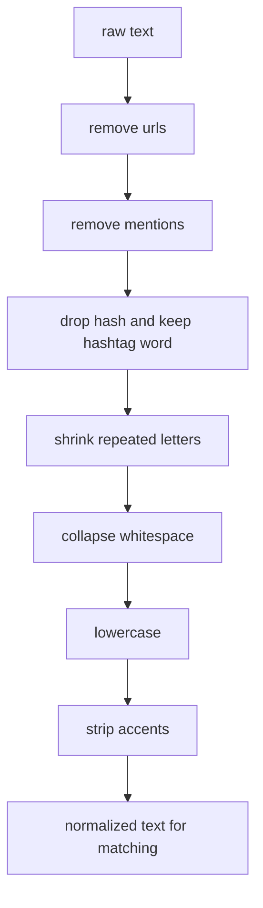

# normalization

this file explains the text cleaning that happens before token matching.

## current operations

our code applies two closely related steps.

1. `normalize_text()`
   1. removes urls
   2. removes user mentions
   3. keeps hashtag content but drops `#`
   4. reduces repeated characters to two copies
   5. collapses extra whitespace
2. `fold_text()`
   1. lowercases the text
   2. strips accents with unicode decomposition

## why this matters

social media text is noisy. if we try to match raw text directly, a small lexicon misses too much.

examples:

1. `@ana ameeeei #filme https://x.com/teste`
2. after normalization: `ameei filme`
3. after folding: `ameei filme`

4. `NÃO gostei do final`
5. after folding: `nao gostei do final`

## visual flow

## why these choices are defensible

the literature on twitter and social text sentiment analysis regularly uses this kind of preprocessing.

1. replacing or removing urls and usernames reduces noise
2. trimming elongated spellings keeps expressive text readable while improving lexical matching
3. lowercasing and accent folding increase dictionary hit rate for a symbolic baseline

## project note

our exact normalization recipe is a project simplification. the general strategy is literature backed, but the exact decisions here were chosen to keep the code small and understandable for the first task.

## references

1. Henrico Bertini Brum and Maria das Graças Volpe Nunes. *Building a Sentiment Corpus of Tweets in Brazilian Portuguese*. 2017. the paper explicitly reports replacing usernames and urls, and trimming repeated characters. [doi](https://doi.org/10.48550/arXiv.1712.08917)
2. Olga Kolchyna, Thársis T. P. Souza, Philip Treleaven, and Tomaso Aste. *Twitter Sentiment Analysis: Lexicon Method, Machine Learning Method and Their Combination*. 2015. the paper discusses removing urls, mentions, hashtags, and tracking elongated words. [doi](https://doi.org/10.48550/arXiv.1507.00955)
3. Marlo Souza and Renata Vieira. *Sentiment Analysis on Twitter Data for Portuguese Language*. PROPOR, 2012. the paper evaluates preprocessing choices for Portuguese twitter data. [doi](https://doi.org/10.1007/978-3-642-28885-2_28)
