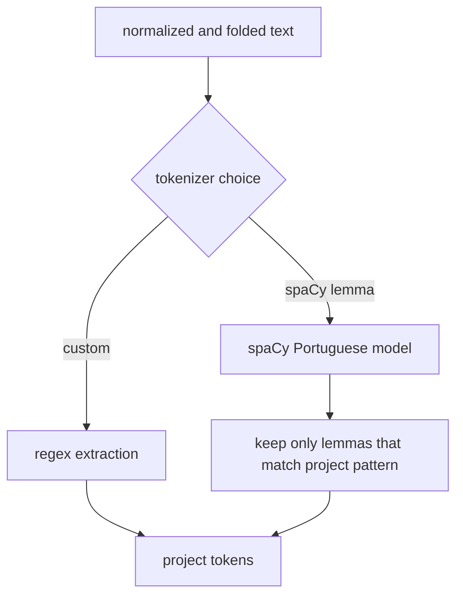

# tokenization and lemmatization

this file explains the two tokenizer options supported by the project.

## tokenizer options

1. custom tokenizer
   1. uses the project regex pattern
   2. keeps alphanumeric tokens and simple emoticons
   3. is easier to explain in class
2. spaCy portuguese lemmatizer
   1. uses the `pt_core_news_sm` portuguese model
   2. benefits from language specific tokenization and lemmatization in spaCy
   3. is filtered at the end so the output still fits our project token inventory

## what the code actually does

both tokenizers receive normalized and folded text first.

after that:

1. the custom tokenizer runs `TOKEN_PATTERN.findall(...)`
2. the spaCy lemmatizer builds a portuguese `Doc`
3. the project keeps only folded lemmas that still satisfy `TOKEN_PATTERN`

this means the spaCy option is language aware during segmentation and morphology, but the final kept lemmas still remain compatible with the symbolic pipeline.

## visual comparison

## example

input: `não gostei :) do app`

1. after folding: `nao gostei :) do app`
2. custom output: `nao`, `gostei`, `:)`, `do`, `app`
3. spaCy path: spaCy segments and lemmatizes first, then the project keeps the lemmas that match the same inventory

## why we kept both options

1. the custom tokenizer is transparent and easy to defend as a symbolic baseline
2. the spaCy option gives more realistic processing for portuguese text with a trained pipeline
3. comparing both makes it easier to show what lemmatization changes and what stays the same

## project note

the final token filter is our own choice. it keeps the spaCy branch aligned with the rest of the pipeline, so score differences mostly reflect segmentation and lemmatization decisions, not a completely different token space.

## references

1. spaCy. *Linguistic Features*. official documentation for tokenization rules, exceptions, prefixes, suffixes, and infixes. [official docs](https://spacy.io/usage/linguistic-features)
2. György Orosz, Zsolt Szántó, Péter Berkecz, Gergő Szabó, and Richárd Farkas. *HuSpaCy: an industrial strength Hungarian natural language processing toolkit*. 2022. the paper summarizes spaCy tokenization as whitespace split followed by language specific boundary rules. [doi](https://doi.org/10.48550/arXiv.2201.01956)
3. Eduardo Santos Duarte. *Sentiment Analysis on Twitter for the Portuguese Language*. 2013. the thesis notes that Portuguese parsing pipelines depend on a tokenizer that separates punctuation and symbols into tokens. [pdf](https://run.unl.pt/bitstream/10362/11338/1/Duarte_2013.pdf)
