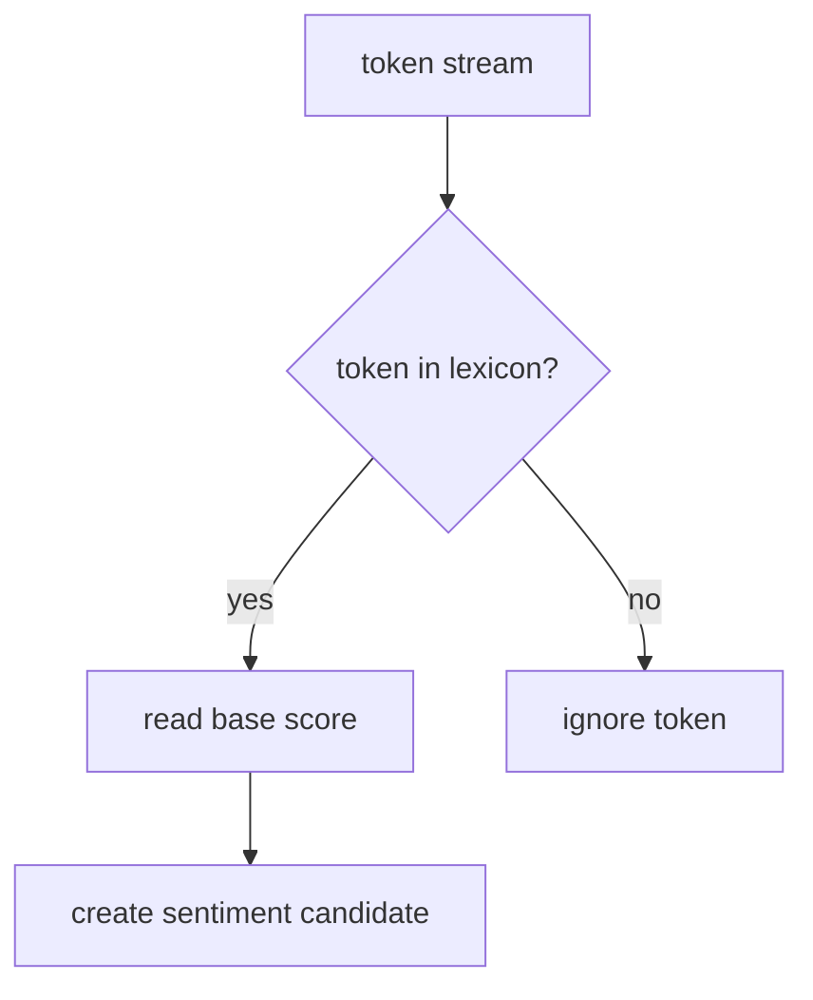

# lexicon matching

this file explains how tokens become sentiment candidates.

## the core idea

lexicon based sentiment analysis only scores the tokens that exist in the dictionary.

in our pipeline:

1. every token is checked against the selected lexicon
2. if the token exists, we read its base polarity score
3. if the token does not exist, we skip it

tokens that do not match are not errors. they are just neutral with respect to the current lexicon.

## visual flow

## example

input tokens:

`filme`, `muito`, `bom`, `mas`, `final`, `confuso`

matches:

1. `bom` -> base score `1.2`
2. `confuso` -> base score `-1.3`

non matches:

1. `filme`
2. `muito`
3. `mas`
4. `final`

notice that `muito` and `mas` are not lexical matches themselves. they matter later as symbolic rules.

## why this step matters

lexicon matching is the bridge between text processing and sentiment scoring.

1. without it, the pipeline has no place to start polarity calculation
2. with it, the model becomes interpretable because every score can be traced back to a concrete token

## references

1. Maite Taboada, Julian Brooke, Milan Tofiloski, Kimberly Voll, and Manfred Stede. *Lexicon Based Methods for Sentiment Analysis*. Computational Linguistics, 2011. [acl anthology](https://aclanthology.org/J11-2001/)
2. Marlo Souza, Renata Vieira, Debora Busetti, Rove Chishman, and Isa Mara Alves. *Construction of a Portuguese Opinion Lexicon from multiple resources*. STIL, 2011. [acl anthology](https://aclanthology.org/W11-4507/)
3. A. Maurits van der Veen, Erik Bleich, and Michael Flor. *The advantages of lexicon based sentiment analysis in an age of machine learning*. PLOS One, 2025. [doi](https://doi.org/10.1371/journal.pone.0313092)
