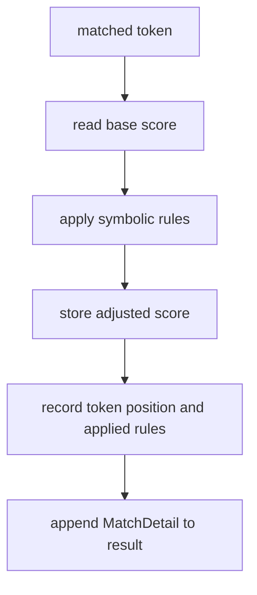

# match records

this file explains how the project stores evidence for each matched token.

## current structure

every matched sentiment token becomes a `MatchDetail` record with five fields.

1. `token`
2. `position`
3. `base_score`
4. `adjusted_score`
5. `applied_rules`

this is important because the project does not only output a final label. it also keeps the reasoning trail that led to that label.

## visual flow



## example

for `não gostei!!!`, the match record for `gostei` can look like this in simplified form:

```python
{
    "token": "gostei",
    "position": 1,
    "base_score": 1.8,
    "adjusted_score": -2.07,
    "applied_rules": ["negation", "exclamation"]
}
```

this makes the system explainable.

1. we know which token triggered sentiment
2. we know where it appeared
3. we know its original lexical value
4. we know which rules changed the final contribution

## why this matters for the report

lexicon based systems are attractive in part because they are easier to inspect than black box classifiers. our `MatchDetail` structure makes that advantage concrete.

## references

1. Maite Taboada, Julian Brooke, Milan Tofiloski, Kimberly Voll, and Manfred Stede. *Lexicon Based Methods for Sentiment Analysis*. Computational Linguistics, 2011. [acl anthology](https://aclanthology.org/J11-2001/)
2. Olga Kellert, Mahmud Uz Zaman, N. H. Matlis, and Carlos Gómez Rodríguez. *Experimenting with UD Adaptation of an Unsupervised Rule based Approach for Sentiment Analysis of Mexican Tourist Texts*. 2023. the paper explicitly connects rule based sentiment methods with interpretability and explainability. [doi](https://doi.org/10.48550/arXiv.2309.05312)
3. A. Maurits van der Veen, Erik Bleich, and Michael Flor. *The advantages of lexicon based sentiment analysis in an age of machine learning*. PLOS One, 2025. [doi](https://doi.org/10.1371/journal.pone.0313092)
