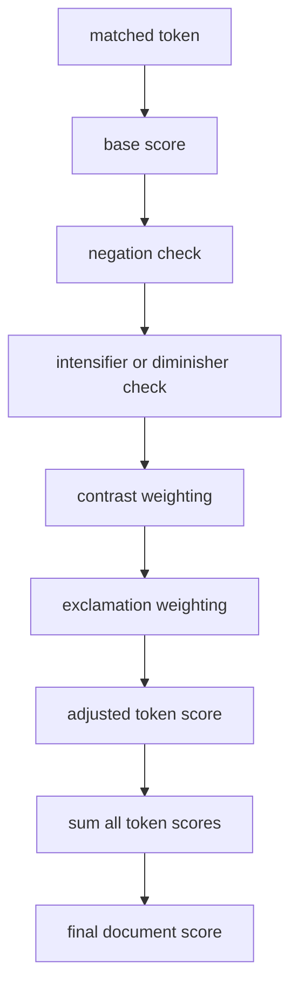

# score calculation

this file explains how the project turns matched tokens into a final positive or negative score.

## the actual order used by the code

for each matched token:

1. start with the lexical base score
2. check negation in the previous three tokens
3. check intensifier on the immediately previous token
4. check diminisher on the immediately previous token
5. check whether the token is before or after the last contrast marker
6. apply exclamation amplification if the original text contains `!`
7. store the adjusted score

after all matched tokens are processed, the final document score is the sum of all adjusted scores.

## formula

in simplified form, for each matched token `t_i`:

```text
adjusted(t_i) = base(t_i)
                * negation_factor
                * intensifier_factor
                * diminisher_factor
                * contrast_factor
                * exclamation_factor

final_score = sum(adjusted(t_i) for each matched token)
```

positive evidence adds to the total. negative evidence subtracts from the total. rule effects can flip the sign or change the magnitude.

## worked examples

1. `muito bom`
   1. `bom = 1.2`
   2. previous token `muito` gives multiplier `1.6`
   3. final contribution `1.92`

2. `nao gostei`
   1. `gostei = 1.8`
   2. negation flips the sign
   3. final contribution `-1.8`

3. `bom, mas horrivel`
   1. `bom = 1.2`, before contrast, so `1.2 * 0.7 = 0.84`
   2. `horrivel = -2.5`, after contrast, so `-2.5 * 1.3 = -3.25`
   3. total score `-2.41`

## visual flow



## project note

the overall additive structure is literature consistent for lexicon based sentiment analysis, but the exact windows, multipliers, and thresholds in this project are ours. they were chosen to keep the baseline small, interpretable, and easy to demonstrate.

## references

1. Maite Taboada, Julian Brooke, Milan Tofiloski, Kimberly Voll, and Manfred Stede. *Lexicon Based Methods for Sentiment Analysis*. Computational Linguistics, 2011. [acl anthology](https://aclanthology.org/J11-2001/)
2. C. Hutto and Eric Gilbert. *VADER: A Parsimonious Rule Based Model for Sentiment Analysis of Social Media Text*. ICWSM, 2014. [aaai](https://ojs.aaai.org/index.php/icwsm/article/view/14550)
3. Svetlana Kiritchenko and Saif M. Mohammad. *The Effect of Negators, Modals, and Degree Adverbs on Sentiment Composition*. WASSA, 2016. [acl anthology](https://aclanthology.org/W16-0410/)
