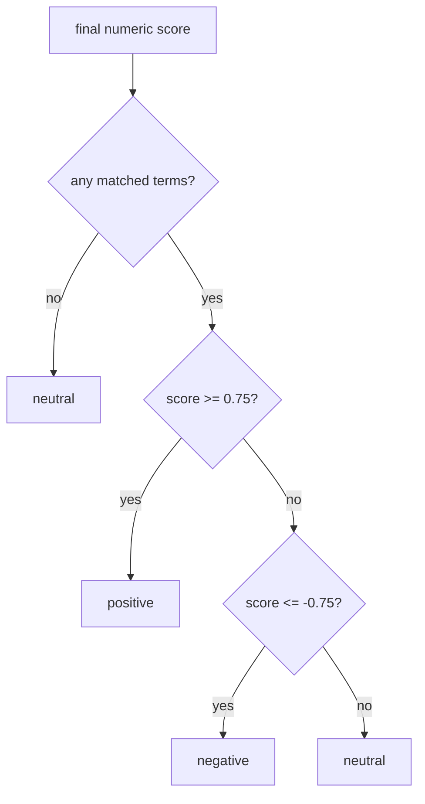

# label assignment

this file explains how the project converts the numeric score into `positive`, `negative`, or `neutral`.

## current rule

1. if there are no matched terms, the label is `neutral`
2. if `score >= 0.75`, the label is `positive`
3. if `score <= -0.75`, the label is `negative`
4. otherwise, the label is `neutral`

## why this exists

sentence scores near zero often reflect mixed evidence, weak evidence, or a lack of lexical evidence. the threshold prevents the system from calling a text positive or negative when the signal is too small.

## examples

1. score `2.10` -> `positive`
2. score `-1.30` -> `negative`
3. score `0.40` -> `neutral`
4. no matched terms -> `neutral`

## visual flow

## project note

the three way label set is standard in sentiment analysis. the exact thresholds `0.75` and `-0.75` are our baseline choice, not a value copied from a paper. we use them to avoid overreacting to very small totals.

## why neutral matters

portuguese sentiment resources and corpora often highlight that neutral content is practical and necessary, especially for social media, where many texts are descriptive, mixed, or weakly opinionated.

## references

1. Henrico Bertini Brum and Maria das Graças Volpe Nunes. *Building a Sentiment Corpus of Tweets in Brazilian Portuguese*. 2017. the paper argues that including the neutral class makes the corpus closer to practical applications. [doi](https://doi.org/10.48550/arXiv.1712.08917)
2. Bo Pang and Lillian Lee. *Seeing Stars: Exploiting Class Relationships for Sentiment Categorization with Respect to Rating Scales*. ACL, 2005. this is a classic reference for moving beyond strict binary polarity. [acl anthology](https://aclanthology.org/P05-1015/)
3. A. Maurits van der Veen, Erik Bleich, and Michael Flor. *The advantages of lexicon based sentiment analysis in an age of machine learning*. PLOS One, 2025. the paper discusses interpretability and calibration in lexicon based scores. [doi](https://doi.org/10.1371/journal.pone.0313092)
