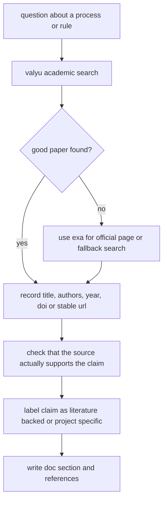

# research and source checking

this file explains how the documentation in `docs/processes/` should be researched and verified in future updates.

## required workflow for this project

1. use a citation management workflow
2. use `valyu` as the primary source for academic search
3. use `exa` as the secondary source for official pages, fallback metadata, and stable public links
4. keep a clear distinction between literature backed claims and project specific design choices

## visual workflow

## what counts as a good source

1. peer reviewed papers
2. acl anthology pages
3. springer pages with doi metadata
4. official project pages for resources we directly use, such as `oplexicon` or spaCy documentation

## how to check a source before citing it

1. read the abstract or the relevant section, not only the title
2. confirm that the paper supports the exact claim you want to make
3. keep the doi when available
4. prefer official publisher or anthology links over mirrors
5. if the source only supports a general idea, say so clearly

## how to write responsibly

1. if a rule or threshold is ours, say it is ours
2. if a paper motivates the idea but not the exact number, do not pretend the paper gave our exact number
3. if a resource is external, cite the resource page and, when possible, the paper that introduced it

## examples from this project

1. `oplexicon v3.0` is cited with both the official PUCRS page and the papers listed by that page
2. the spaCy tokenizer option is cited with the official spaCy documentation and a paper that summarizes spaCy tokenization behavior
3. the seed lexicon ranges are documented as our own design, but justified with literature on graded polarity scores

## references

1. PUCRS. *OpLexicon*. official resource page. [official page](https://www.inf.pucrs.br/linatural/wordpress/recursos-e-ferramentas/oplexicon/)
2. spaCy. *Linguistic Features*. official documentation. [official docs](https://spacy.io/usage/linguistic-features)
3. ACL Anthology. stable source used for several papers in this folder, including Taboada 2011, Wiegand 2010, and Kiritchenko and Mohammad 2016. [acl anthology](https://aclanthology.org/)
