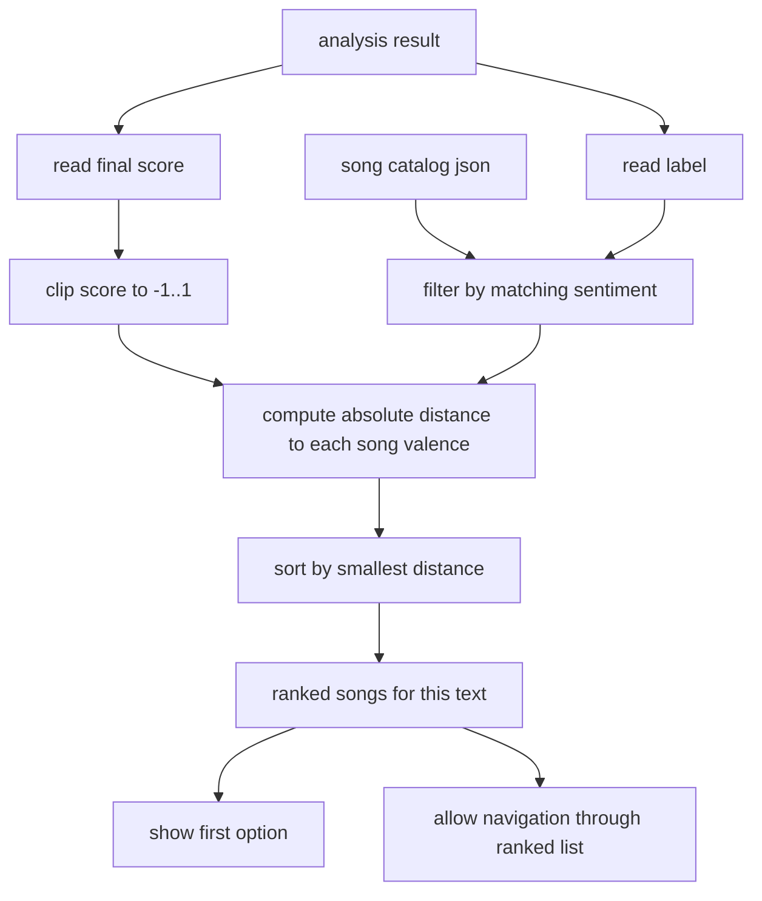

# song recommendation

this file explains how the streamlit app turns a sentiment result into a ranked list of song suggestions.

the recommendation stage happens after text classification. it does not change the sentiment label. it only uses the label and score already produced by the symbolic analyzer.

## the actual order used by the code

for each analyzed text:

1. read the local song catalog from `data/recommendations.json`
2. take the predicted label from the analyzer: `positive`, `negative`, or `neutral`
3. take the final analyzer score
4. clip that score to the interval `[-1, 1]`
5. keep only the songs whose `sentiment` field matches the predicted label
6. compute the distance between the clipped text score and each song `valence`
7. sort the matching songs by smallest distance first
8. show the first ranked song by default
9. if more songs exist for that label, let the user move through the ranked list with `voltar` and `outra sugestão`

the streamlit counter such as `opção 2 de 4` refers to the number of songs available for the predicted label after ranking, not to the total number of songs in the full catalog.

## catalog fields

each song entry currently stores:

1. `title`
2. `artist`
3. `youtube_id`
4. `sentiment`
5. `valence`
6. optional `tags`

example:

```json
{
  "title": "País Tropical",
  "artist": "Jorge Ben Jor",
  "youtube_id": "JzByVhWju88",
  "sentiment": "positive",
  "valence": 0.9,
  "tags": ["samba", "festivo"]
}
```

## formula

the recommendation ranking is a simple distance rule:

```text
target_score = clip(analyzer_score, -1, 1)

distance(song) = abs(song.valence - target_score)

ranked_songs = sort matching songs by distance ascending
```

the best recommendation is the song with the smallest distance to the analyzed text score inside the predicted sentiment bucket.

## worked examples

1. positive text with score `1.68`
  1. clip score to `1.0`
  2. keep only positive songs
  3. compute distances with the current catalog:
    1. `País Tropical`, valence `0.9`, distance `0.1`
    2. `Mas Que Nada`, valence `0.85`, distance `0.15`
    3. `Anunciação`, valence `0.82`, distance `0.18`
    4. `Tocando em Frente`, valence `0.6`, distance `0.4`
  4. ranked order becomes:
    1. `País Tropical`
    2. `Mas Que Nada`
    3. `Anunciação`
    4. `Tocando em Frente`
2. negative text with score `-1.2`
  1. clip score to `-1.0`
  2. keep only negative songs
  3. compute distances with the current catalog:
    1. `Cálice`, valence `-0.9`, distance `0.1`
    2. `Construção`, valence `-0.85`, distance `0.15`
    3. `Tempo Perdido`, valence `-0.55`, distance `0.45`
  4. ranked order becomes:
    1. `Cálice`
    2. `Construção`
    3. `Tempo Perdido`
3. neutral text with score `0.05`
  1. the score already lies in `[-1, 1]`, so it is kept as `0.05`
  2. keep only neutral songs
  3. compute distances with the current catalog:
    1. `Sampa`, valence `0.0`, distance `0.05`
    2. `Águas de Março`, valence `0.1`, distance `0.05`
    3. `Saudosa Maloca`, valence `-0.1`, distance `0.15`
  4. ranked order becomes:
    1. `Sampa`
    2. `Águas de Março`
    3. `Saudosa Maloca`

when distances tie, python keeps the original catalog order because the sort is stable.

## visual flow




## project note

the recommendation module is intentionally simple and local.

1. it does not use spotify, last.fm, or any external recommendation api
2. it does not learn from user behavior
3. it does not analyze audio
4. it uses a small curated catalog and a deterministic ranking rule

the most important limitation is the current `valence` field.

1. these valence values were assigned manually
2. they are not extracted from audio features
3. they are not estimated from a labeled music dataset
4. they should be treated as a small demonstrative scoring layer for the app, not as a validated affective ground truth

that means the ranking logic is deterministic and easy to explain, but the quality of the output still depends on how good the catalog annotations are.

## references

1. Francesco Ricci, Lior Rokach, and Bracha Shapira, editors. *Recommender Systems Handbook*. Springer, 2022. [springer](https://link.springer.com/book/10.1007/978-1-0716-2197-4)
2. Michael J. Pazzani and Daniel Billsus. *Content Based Recommendation Systems*. In *The Adaptive Web*, 2007. [springer](https://link.springer.com/chapter/10.1007/978-3-540-72079-9_10)

