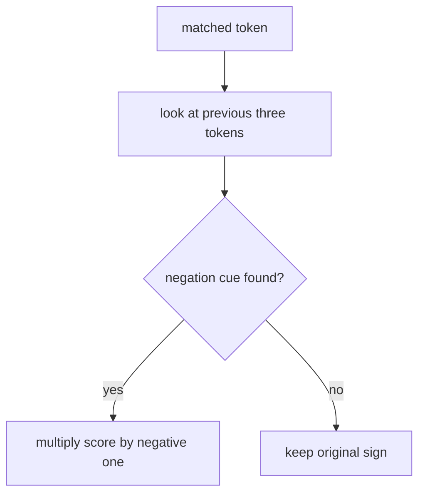

# negation rule

this file explains the negation heuristic used in the project.

## current rule in code

if any of the previous three tokens belongs to the set below, the sign of the matched token is inverted.

1. `nao`
2. `nem`
3. `nunca`
4. `jamais`
5. `sem`

## what this means mathematically

1. positive score becomes negative
2. negative score becomes positive

example:

1. `gostei` -> `1.8`
2. `nao gostei` -> `-1.8`

## visual flow

## why we use a short window

a short context window is a practical symbolic approximation.

1. it is simple to explain
2. it captures many common short sentence cases
3. it keeps the first baseline small

## limitations

this rule is intentionally simple.

1. it does not compute full negation scope
2. it may over flip in unusual sentence structures
3. it may miss long distance negation

## project note

the idea of modeling negation comes directly from the literature. the exact three token window is our own baseline simplification.

## references

1. Michael Wiegand, Alexandra Balahur, Benjamin Roth, Dietrich Klakow, and Andrés Montoyo. *A survey on the role of negation in sentiment analysis*. 2010. [acl anthology](https://aclanthology.org/W10-3111/)
2. Svetlana Kiritchenko and Saif M. Mohammad. *The Effect of Negators, Modals, and Degree Adverbs on Sentiment Composition*. WASSA, 2016. [acl anthology](https://aclanthology.org/W16-0410/)
3. Marlo Souza and Renata Vieira. *Sentiment Analysis on Twitter Data for Portuguese Language*. PROPOR, 2012. the paper explicitly evaluates negation models for Portuguese twitter data. [doi](https://doi.org/10.1007/978-3-642-28885-2_28)
