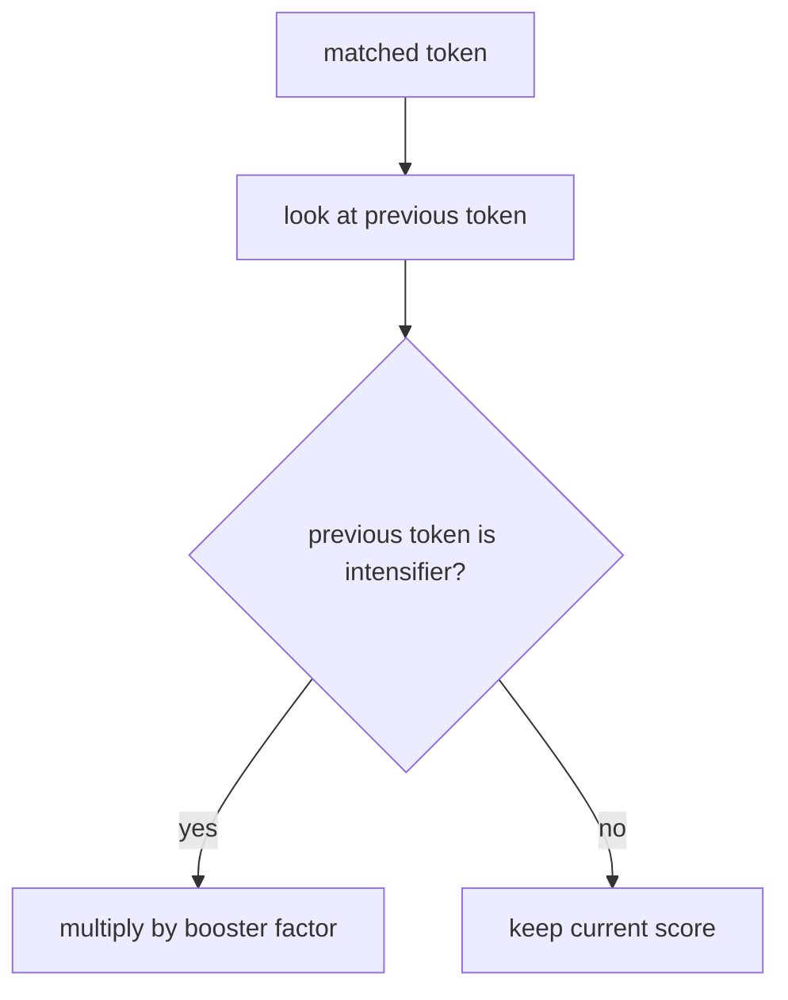

# intensifier rule

this file explains how the project strengthens sentiment when a booster word appears immediately before a matched token.

## current intensifiers

1. `muito` -> `1.6`
2. `super` -> `1.5`
3. `bem` -> `1.2`
4. `demais` -> `1.4`
5. `realmente` -> `1.2`
6. `bastante` -> `1.3`

## current behavior

if the immediately previous token is one of these words, the matched token score is multiplied by the corresponding factor.

examples:

1. `bom` -> `1.2`
2. `muito bom` -> `1.2 * 1.6 = 1.92`

3. `ruim` -> `-1.4`
4. `super ruim` -> `-1.4 * 1.5 = -2.1`

## visual flow

## why this rule exists

intensifiers are one of the clearest ways writers signal stronger affect in short text. a sentence like `muito bom` is not just positive. it is more positive than `bom`.

## project note

literature supports the use of booster words and degree adverbs. our exact factor values are project settings chosen for interpretability, not copied from one paper.

## references

1. Maite Taboada, Julian Brooke, Milan Tofiloski, Kimberly Voll, and Manfred Stede. *Lexicon Based Methods for Sentiment Analysis*. Computational Linguistics, 2011. [acl anthology](https://aclanthology.org/J11-2001/)
2. Svetlana Kiritchenko and Saif M. Mohammad. *The Effect of Negators, Modals, and Degree Adverbs on Sentiment Composition*. WASSA, 2016. [acl anthology](https://aclanthology.org/W16-0410/)
3. C. Hutto and Eric Gilbert. *VADER: A Parsimonious Rule Based Model for Sentiment Analysis of Social Media Text*. ICWSM, 2014. [aaai](https://ojs.aaai.org/index.php/icwsm/article/view/14550)
