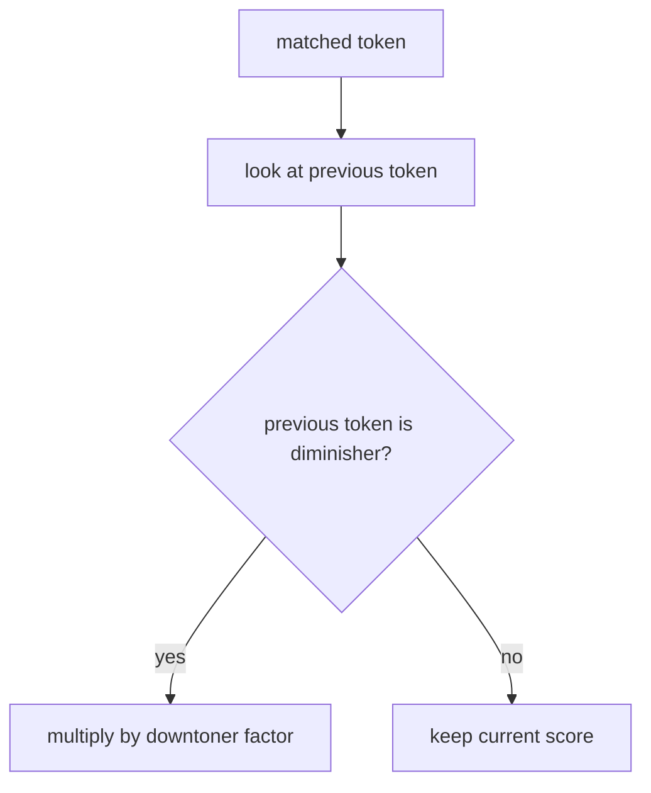

# diminisher rule

this file explains how the project weakens sentiment when a downtoner appears immediately before a matched token.

## current diminishers

1. `pouco` -> `0.6`
2. `meio` -> `0.75`
3. `quase` -> `0.8`

## current behavior

if the immediately previous token is one of these words, the matched token score is multiplied by the corresponding factor.

examples:

1. `bom` -> `1.2`
2. `meio bom` -> `1.2 * 0.75 = 0.9`

3. `ruim` -> `-1.4`
4. `pouco ruim` -> `-1.4 * 0.6 = -0.84`

## visual flow

## why this rule exists

not every nearby modifier strengthens sentiment. some modifiers soften it. this is why `meio bom` should contribute less than `bom`.

## project note

the general idea is literature backed. our exact multiplier values are a small baseline choice.

## references

1. Maite Taboada, Julian Brooke, Milan Tofiloski, Kimberly Voll, and Manfred Stede. *Lexicon Based Methods for Sentiment Analysis*. Computational Linguistics, 2011. [acl anthology](https://aclanthology.org/J11-2001/)
2. Svetlana Kiritchenko and Saif M. Mohammad. *The Effect of Negators, Modals, and Degree Adverbs on Sentiment Composition*. WASSA, 2016. [acl anthology](https://aclanthology.org/W16-0410/)
3. Andres Algaba, David Ardia, Keven Bluteau, Samuel Borms, and Kris Boudt. *Econometrics Meets Sentiment: An Overview of Methodology and Applications*. 2020. the paper summarizes amplifiers, downtoners, negators, and adversative conjunctions as common valence shifters. [doi](https://doi.org/10.1111/joes.12370)
