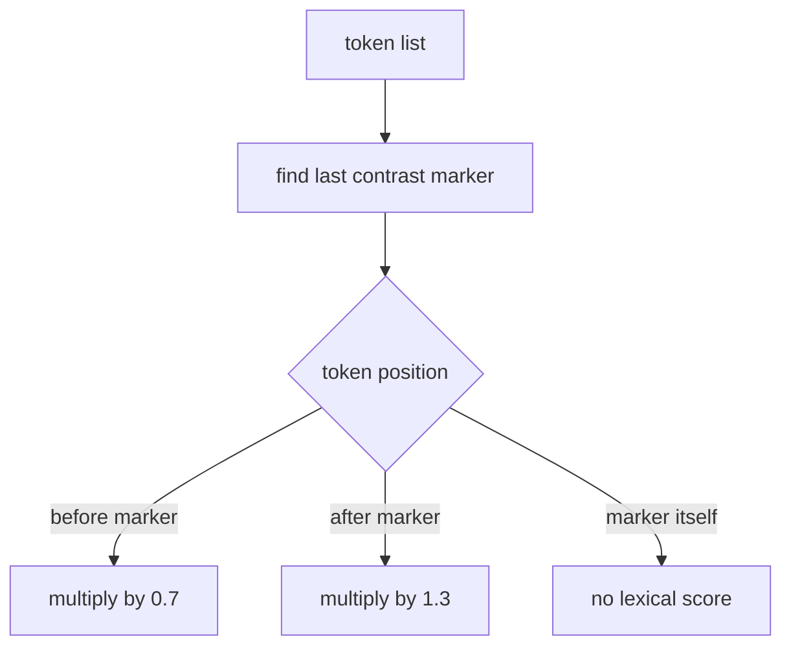

# contrast rule

this file explains how the project handles contrast markers such as `mas`.

## current markers

1. `mas`
2. `porem`
3. `contudo`
4. `entretanto`

## current behavior

the code finds the last contrast marker in the token list.

1. tokens before that marker are multiplied by `0.7`
2. tokens after that marker are multiplied by `1.3`

this means the second clause gets more weight.

## example

`bom, mas caro`

1. `bom = 1.2`, before contrast -> `0.84`
2. `caro = -1.0`, after contrast -> `-1.3`
3. total -> `-0.46`

## visual flow

## why this rule exists

adversative conjunctions often shift the rhetorical focus to the later clause. in everyday reading, `x, mas y` usually makes `y` feel more decisive than `x`.

## project note

the intuition is well known in rule based sentiment analysis. our exact weights `0.7` and `1.3`, and the choice to use the last marker, are project settings.

## references

1. C. Hutto and Eric Gilbert. *VADER: A Parsimonious Rule Based Model for Sentiment Analysis of Social Media Text*. ICWSM, 2014. the paper uses contrastive conjunction handling as one of its main heuristics. [aaai](https://ojs.aaai.org/index.php/icwsm/article/view/14550)
2. Maite Taboada, Julian Brooke, Milan Tofiloski, Kimberly Voll, and Manfred Stede. *Lexicon Based Methods for Sentiment Analysis*. Computational Linguistics, 2011. [acl anthology](https://aclanthology.org/J11-2001/)
3. Andres Algaba, David Ardia, Keven Bluteau, Samuel Borms, and Kris Boudt. *Econometrics Meets Sentiment: An Overview of Methodology and Applications*. 2020. the paper lists adversative conjunctions such as `but` as common valence shifters in lexicon based sentiment systems. [doi](https://doi.org/10.1111/joes.12370)
