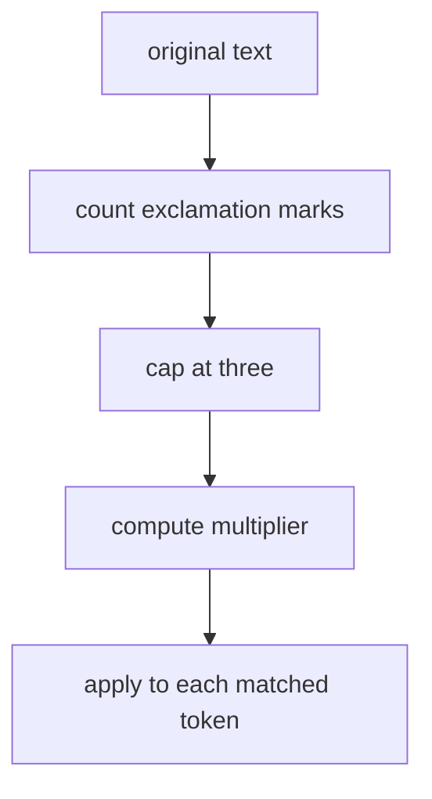

# exclamation rule

this file explains how exclamation marks change sentiment magnitude in the project.

## current behavior

1. count `!` in the original text
2. cap the count at `3`
3. compute multiplier `1 + 0.05 * count`
4. apply that multiplier to each matched token score

this creates the following scale.

1. `0` exclamation marks -> `1.00`
2. `1` exclamation mark -> `1.05`
3. `2` exclamation marks -> `1.10`
4. `3` or more exclamation marks -> `1.15`

## example

`amei!!!`

1. base score of `amei` -> `2.6`
2. exclamation multiplier -> `1.15`
3. adjusted score -> `2.99`

## visual flow

## why this rule exists

repeated punctuation often signals emphasis in short informal text. in other words, `bom!!!` is usually read as stronger than plain `bom`.

## project note

the use of punctuation as an intensity cue is literature backed. the exact multiplier `0.05` per exclamation mark and the cap at `3` are our baseline choice.

## references

1. C. Hutto and Eric Gilbert. *VADER: A Parsimonious Rule Based Model for Sentiment Analysis of Social Media Text*. ICWSM, 2014. the paper treats punctuation as an intensity heuristic for social media text. [aaai](https://ojs.aaai.org/index.php/icwsm/article/view/14550)
2. VADER documentation. *Resources and Dataset Descriptions*. the documentation explains that punctuation amplifies intensity and that the lexicon models polarity and intensity. [docs](https://vadersentiment.readthedocs.io/en/latest/pages/resource_description.html)
3. Olga Kolchyna, Thársis T. P. Souza, Philip Treleaven, and Tomaso Aste. *Twitter Sentiment Analysis: Lexicon Method, Machine Learning Method and Their Combination*. 2015. the paper includes punctuation marks among manually constructed sentiment features. [doi](https://doi.org/10.48550/arXiv.1507.00955)
